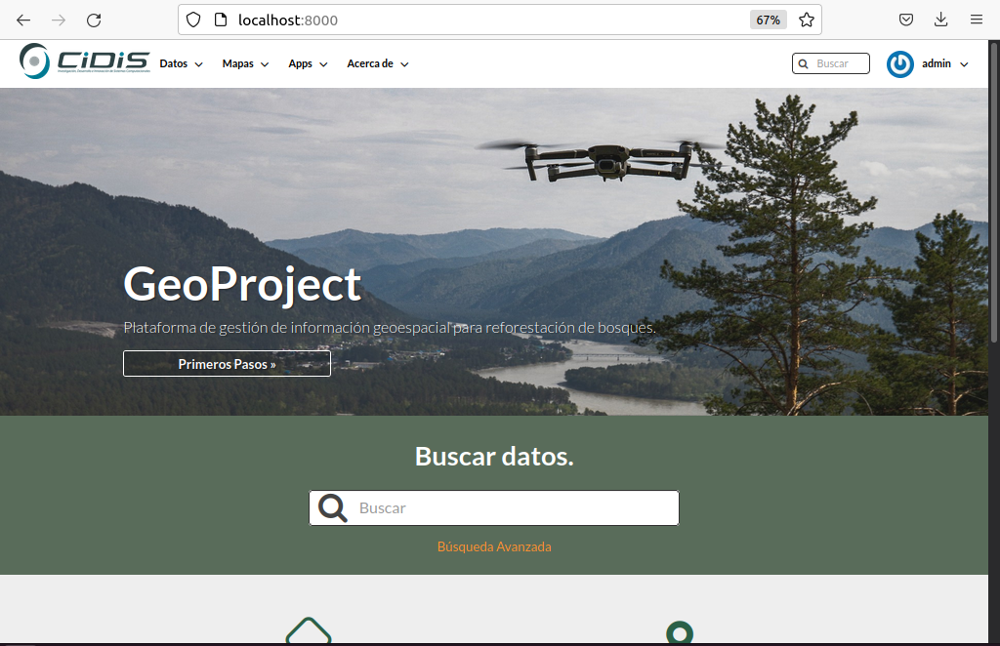

# GeoProject
Sistema de gestión de información geospacial para reforestación de bosques mediante uso de drones, está basado en **[Geonode](https://geonode.org/)** que es un software libre. Geonode forma parte de [OSGEO](https://www.osgeo.org) que se encarga de dar soporte y promover el desarrollo colaborativo de tecnologías geoespaciales y datos abiertos 
## Proyectos utilizados
  * [Geonode](https://github.com/UDannyf/geonode) : plataforma de gestión de datos geoespaciales
  * [Mapstore](https://github.com/UDannyf/geonode-mapstore-client): visualizador de mapas para geonode
  * [WebOdm](https://github.com/UDannyf/WebODM) : cliente web de OpenDroneMap 
  * [Deepforest](https://github.com/UDannyf/DeepForest): modelo de clasificación de copas de árboles
## Origen de datos
La fuente de información para el sistema proviene de imágenes aéreas capturadas por drones. A partir de estas imágenes se genera una ortofoto con OpenDroneMap, luego mediante el uso de **[DeepForest](https://deepforest.readthedocs.io/en/latest/)** se elabora una máscara binaria para generar un archivo shapefile con infomración de la zona que no posee bosques.
## Proceso de imagenes
Para el procesamiento de las imágenes deepforest provee un dataframe con las coordenadas de cada copa de árbol detectada, además con operaciones morfológicas de erosión y apertura se agrupa para formar una zona de bosque.
| Ortofoto | Máscara | Zona reforestable |
| --------- | --------- | --------- |
|  |  | |
## Instalación
* Desarrollo
     * Seguir la **[Guía de instalación](Guia_Instalacion.pdf)** 
       > Para poner en producción considerar la documentación oficial de [Geonode](https://docs.geonode.org/en/master/about/index.html#) de acuerdo al sistema operativo 

## Sistema
### Inicio
El inicio incluye un dashboard con la inforamción de capas, mapas, usuarios
   

## Modificación de Geonode
* Diseño 
     * Agregar Logo **[CIDIS](Guia_Instalacion.pdf)**
     * Fondo para pagina principal
       > Para futuras implementaciones verificar licencia de uso de imagen
* Funcionalidad
     *  Anotaciones: Versión de Mapstore 3.3.x
     *  DeepForest: Aplicación para obtener shapefile
        > Forest, aplicación de django agregada al proyecto que genera el shapefile a partir de una ortofoto
